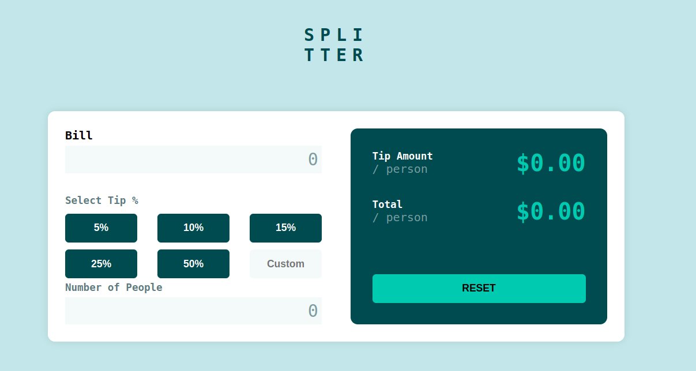
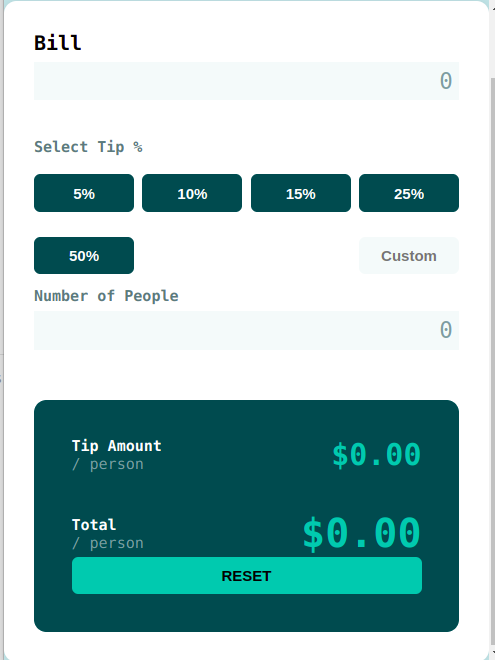

# Frontend Mentor - Tip calculator app solution

This is a solution to the [Tip calculator app challenge on Frontend Mentor](https://www.frontendmentor.io/challenges/tip-calculator-app-ugJNGbJUX). Frontend Mentor challenges help me improve my coding skills by building realistic projects.

## Table of contents

- [Overview](#overview)
  - [The challenge](#the-challenge)
  - [Screenshot](#screenshot)
  - [Links](#links)
  - [Author](#author)
  

## Overview

### The challenge

Users should be able to:

- View the optimal layout for the app depending on their device's screen size
- See hover states for all interactive elements on the page
- Calculate the correct tip and total cost of the bill per person

### Screenshot

### Links

- Solution URL: [Github Link](https://github.com/Lauraalinda/Front-end-mentor-challenge-Tip-Calculator)
- Live Site URL: [Live site](https://spontaneous-granita-b723eb.netlify.app)

## My process

### Built with

- Semantic HTML5 markup
- CSS custom properties
- Flexbox

## Author

- Website - [Laura Alinda](https://poetic-narwhal-715626.netlify.app/)
- Frontend Mentor - [@LauraAlinda](https://www.frontendmentor.io/profile/LauraAlinda)
- Twitter - [@LauraAlinda6](https://www.twitter.com/LauraAlinda6)

